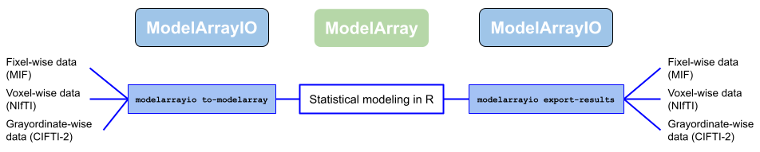

============
ModelArrayIO
============

.. image:: https://img.shields.io/pypi/v/modelarrayio.svg
   :target: https://pypi.python.org/pypi/modelarrayio/
   :alt: Latest Version

.. image:: https://img.shields.io/pypi/pyversions/modelarrayio.svg
   :target: https://pypi.python.org/pypi/modelarrayio/
   :alt: PyPI - Python Version

.. image:: https://img.shields.io/badge/License-BSD%203--Clause-blue.svg
   :target: https://opensource.org/licenses/BSD-3-Clause
   :alt: License

.. image:: https://readthedocs.org/projects/modelarrayio/badge/?version=latest
   :target: http://modelarrayio.readthedocs.io/en/latest/?badge=latest
   :alt: Documentation Status

.. image:: https://github.com/PennLINC/ModelArrayIO/actions/workflows/tox.yml/badge.svg
   :target: https://github.com/PennLINC/ModelArrayIO/actions/workflows/tox.yml
   :alt: GitHub Actions: Tox

.. image:: https://codecov.io/gh/pennlinc/modelarrayio/branch/main/graph/badge.svg
   :target: https://codecov.io/gh/pennlinc/modelarrayio
   :alt: Codecov

.. image:: https://img.shields.io/badge/code%20style-ruff-000000.svg
   :target: https://github.com/astral-sh/ruff
   :alt: Code style: ruff

**ModelArrayIO** is a Python package that converts between neuroimaging formats (fixel ``.mif``, voxel NIfTI, CIFTI-2 dscalar) and the HDF5 (``.h5``) layout used by the R package `ModelArray <https://pennlinc.github.io/ModelArray/>`_. It can also write ModelArray statistical results back to imaging formats.

**Relationship to ConFixel:** The earlier project `ConFixel <https://github.com/PennLINC/ConFixel>`_ is superseded by ModelArrayIO. The ConFixel repository is retained for history (including links from publications) and will be archived; new work should use this repository.

Documentation for installation and usage: `ModelArrayIO on GitHub <https://github.com/PennLINC/ModelArrayIO#installation>`_ (this README). For conda, HDF5 libraries, and installing the ModelArray R package, see the ModelArray vignette `Installation <https://pennlinc.github.io/ModelArray/articles/installations.html>`_.

.. readme-overview-figure-placeholder

.. readme-overview-figure-end

ModelArrayIO provides three converter areas, each with import and export commands:

Once ModelArrayIO is installed, these commands are available in your terminal:

* **Fixel-wise** data (MRtrix ``.mif``):

  * ``.mif`` → ``.h5``: ``modelarrayio mif-to-h5``
  * ``.h5`` → ``.mif``: ``modelarrayio h5-to-mif``

* **Voxel-wise** data (NIfTI):

  * NIfTI → ``.h5``: ``modelarrayio nifti-to-h5``
  * ``.h5`` → NIfTI: ``modelarrayio h5-to-nifti``

* **Greyordinate-wise** data (CIFTI-2):

  * CIFTI-2 → ``.h5``: ``modelarrayio cifti-to-h5``
  * ``.h5`` → CIFTI-2: ``modelarrayio h5-to-cifti``

Storage backends: HDF5 and TileDB
=================================

ModelArrayIO supports two on-disk backends for the subject-by-element matrix:

* HDF5 (default), implemented in ``modelarrayio/h5_storage.py``
* TileDB, implemented in ``modelarrayio/tiledb_storage.py``

Both backends expose a similar API:

* create a dense 2D array ``(subjects, items)`` and write all values at once
* create an empty array with the same shape and write by column stripes
* write/read column names alongside the data

Notes and minor differences:

* Chunking vs tiling: HDF5 uses chunks; TileDB uses tiles. We compute tile sizes analogous to chunk sizes to keep write/read patterns similar.
* Compression: HDF5 uses ``gzip`` by default; TileDB defaults to ``zstd`` with shuffle for better speed/ratio. You can switch to ``gzip`` for parity.
* Metadata: HDF5 stores ``column_names`` as a dataset attribute; TileDB stores names as JSON metadata on the array/group.
* Layout: Both backends keep dimensions in the same order and use zero-based indices.
